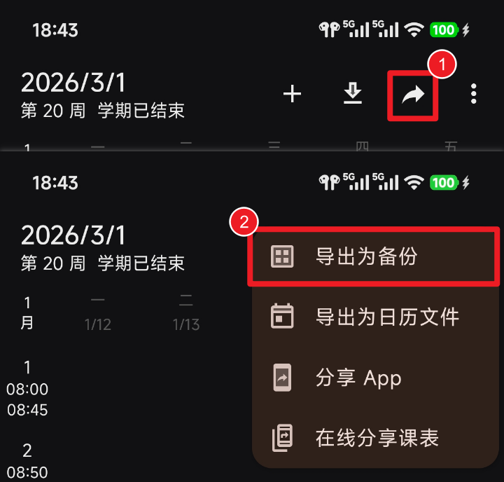
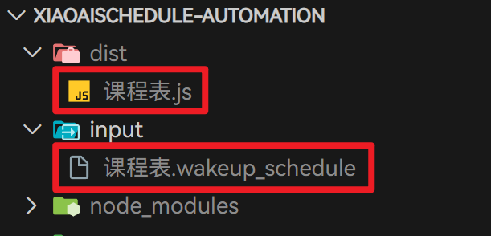
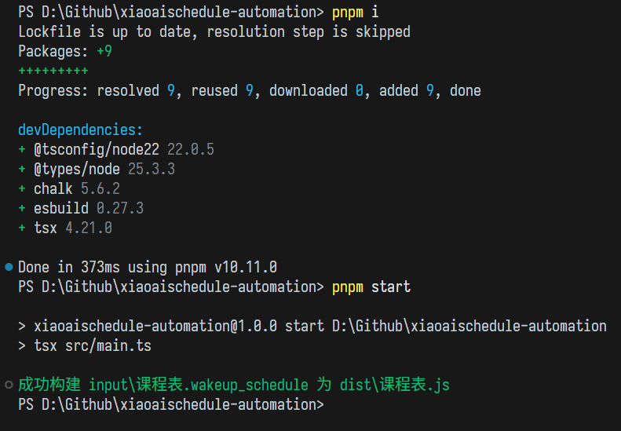
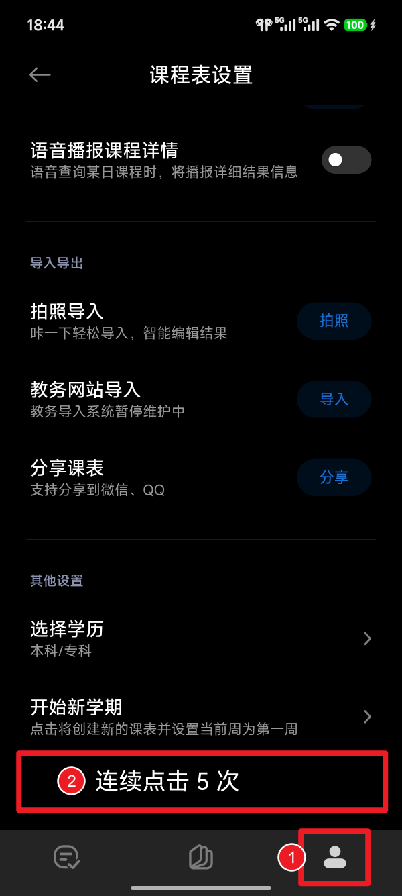
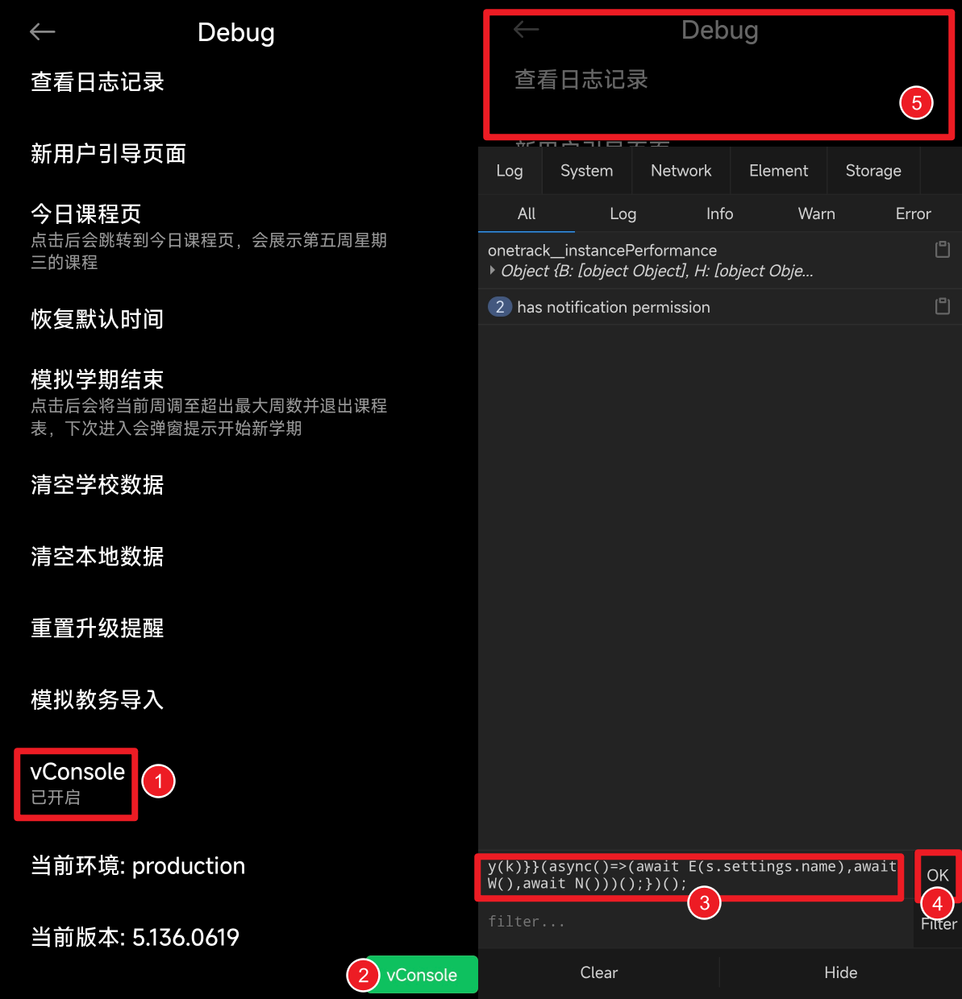

# xiaoaischedule-automation

小爱课程表自动化导入。

## 来由

小爱课程表的教务导入功能已停止维护。原本只是关闭入口，可以通过 vConsole 转到导入页面，但后来封堵了 API，导致彻底无法导入。

[WakeUp 课程表](https://www.wakeup.fun/) 长期维护教务导入功能，而且很好用。因此制作了此工具，读取 WakeUp 课程表的导出文件，在小爱课程表中模拟点击输入实现导入。

## 使用指南

前置要求：**安装 Node.js 和 pnpm**。

在 WakeUp 课程表导入或创建课表后，点击右上角分享按钮，选择「导出为备份」，此时会产生一个 `.wakeup_schedule` 文件。



在项目目录下新建 `input` 目录并把导出的文件放进去。在终端执行命令：

```sh
pnpm i
pnpm start
```

会在 `dist` 目录产生同名的 `.js` 文件。效果如下：





复制 `.js` 文件内容。在手机上打开小爱课程表，转到课程表设置，拉到最底下空白处，连续点击此处空白 5 次，将进入开发者模式。





进入后

- 点击 vConsole 项，右下角会出现 vConsole 绿色按钮
- 将刚才的 `.js` 文件内容复制到 Command 框中（注意不是下面的 Filter）
- 点击 OK
- 点击上方空白处收起 vConsole

此时脚本会新建课程表并自动导入。每次操作之间间隔 1.5s，这是由于小爱课程表的 API 有频率限制，操作过于频繁会被拒绝。几秒钟没反应了就是执行完了。

## License

MIT